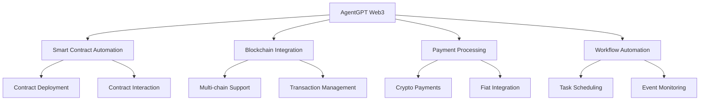

# AgentGPT Web3 Automation Framework

<div align="center">
  
  
  [](https://badge.fury.io/js/agentgpt-web3)
  [](https://opensource.org/licenses/MIT)
  [](https://www.typescriptlang.org/)
  [](https://discord.gg/agentgpt)
</div>

## 🌟 Overview

AgentGPT Web3 Automation Framework is a powerful TypeScript/JavaScript library that enables seamless integration of GPT-4 capabilities with Web3 workflows. This framework automates complex blockchain operations, smart contract interactions, and decentralized application workflows with zero human intervention.

## 📊 Features



## 🚀 Quick Start

### Installation

```bash
npm install agentgpt-web3
# or
yarn add agentgpt-web3
```

### Basic Usage

```typescript
import { AgentGPT } from 'agentgpt-web3';

const agent = new AgentGPT({
  apiKey: process.env.AGENTGPT_API_KEY,
  network: 'ethereum',
  provider: process.env.WEB3_PROVIDER_URL
});

// Initialize automation workflow
await agent.initialize();

// Execute automated task
const result = await agent.executeTask({
  type: 'contract_interaction',
  contractAddress: '0x...',
  method: 'transfer',
  params: ['0x...', '1000000000000000000']
});
```

## 📋 Project Structure

```
web3-automation/
├── src/
│   ├── core/
│   │   ├── agent.ts
│   │   ├── blockchain.ts
│   │   └── workflow.ts
│   ├── contracts/
│   │   ├── interfaces/
│   │   └── abis/
│   ├── utils/
│   │   ├── crypto.ts
│   │   └── validation.ts
│   └── types/
├── tests/
├── examples/
└── docs/
```

## 🔧 Configuration

| Option | Type | Description | Default |
|--------|------|-------------|---------|
| apiKey | string | AgentGPT API key | required |
| network | string | Blockchain network | 'ethereum' |
| provider | string | Web3 provider URL | required |
| timeout | number | Request timeout (ms) | 30000 |
| retries | number | Max retry attempts | 3 |

## 📚 Documentation

For detailed documentation, visit our [GitBook](https://agent-gpt.gitbook.io/agent-gpt).

## 🤝 Contributing

We welcome contributions! Please see our [Contributing Guide](CONTRIBUTING.md) for details.

## 📞 Support

- Website: [https://agent-gpt.org](https://agent-gpt.org)
- Documentation: [https://agent-gpt.gitbook.io/agent-gpt](https://agent-gpt.gitbook.io/agent-gpt)
- Email: support@agent-gpt.org
- Telegram: [https://t.me/agentgptorg](https://t.me/agentgptorg)
- Twitter: [https://x.com/agentgptorg](https://x.com/agentgptorg)
- GitHub: [https://github.com/agentgptorg](https://github.com/agentgptorg)

## 📄 License

This project is licensed under the MIT License - see the [LICENSE](LICENSE) file for details.

## 🔐 Security

For security concerns, please email security@agent-gpt.org or create a security advisory on GitHub.

---

<div align="center">
  Made with ❤️ by the AgentGPT Team
</div> 